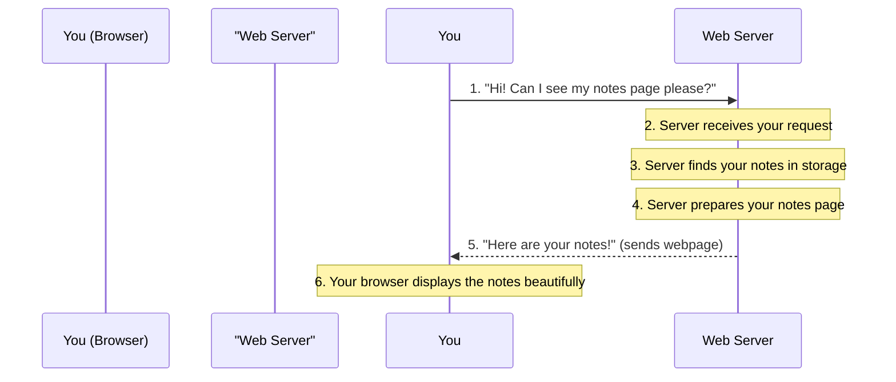
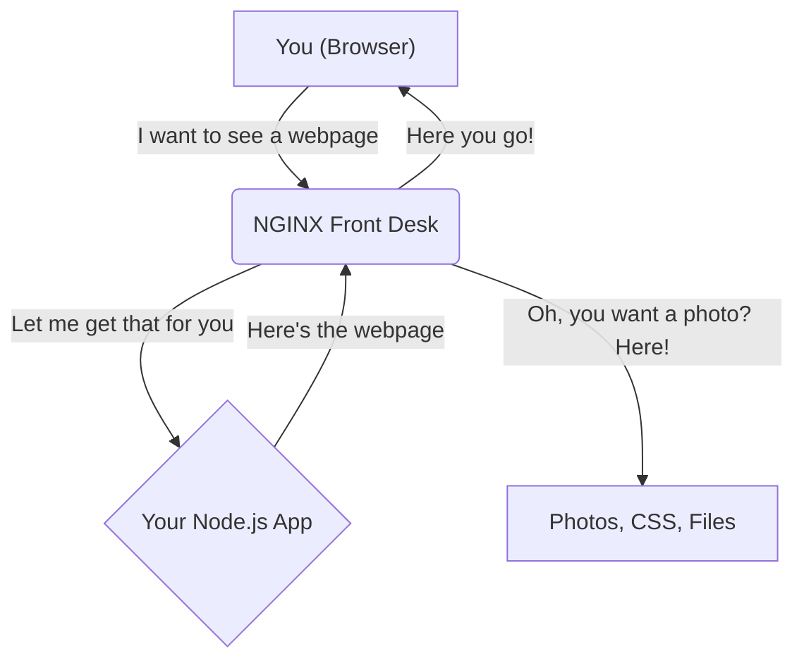
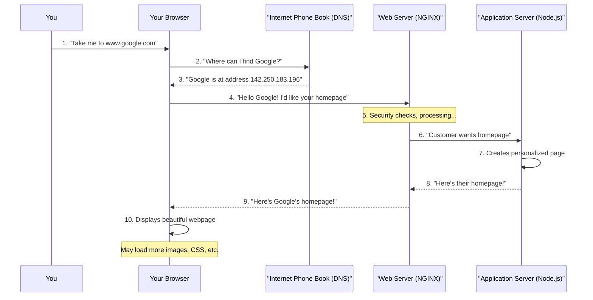
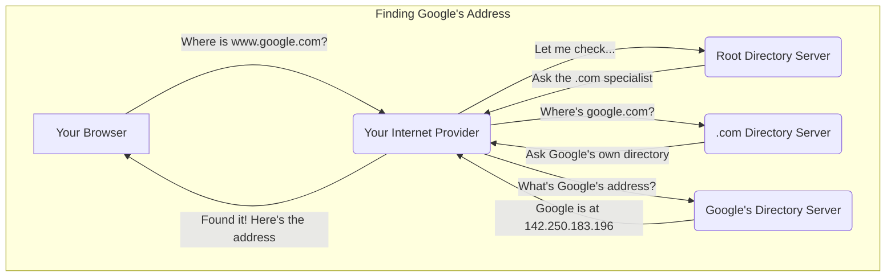
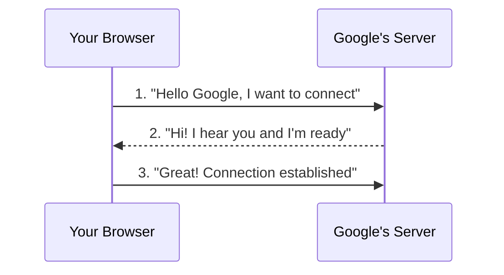
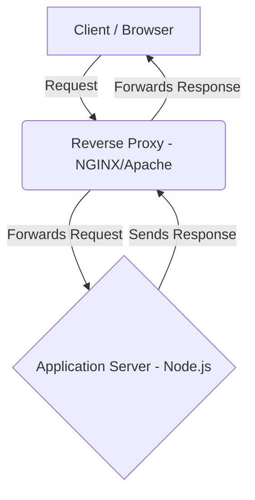
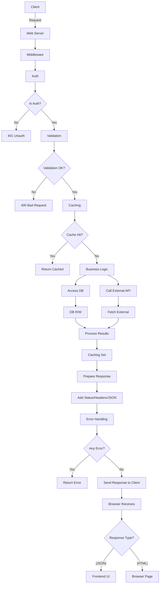

# A Complete Beginner's Guide to How the Web Works: From Click to Page

**Ever wondered what happens when you type "google.com" and hit Enter?** 

This guide will take you on a journey through the internet, explaining exactly what happens from the moment you click a link or type a web address until a webpage appears on your screen. We'll use simple language, real-world analogies, and visual diagrams to make even the most complex concepts easy to understand.

**Think of this as your friendly tour guide through the digital world!**

*No technical background required - let's explore together!*

## Chapter 1: Understanding HTTP - The Language of the Internet

Imagine you're in a foreign country and need to ask for directions. You and the local person need a common language to communicate, right? 

**HTTP (HyperText Transfer Protocol)** is exactly like that common language - but for computers! It's the universal language that your web browser (like Chrome, Firefox, or Safari) uses to "talk" to web servers around the world.

### Think of HTTP Like Ordering at a Restaurant:

When you go to a restaurant, there's a specific way things work:
1. **You (the customer)** look at the menu and decide what you want
2. **You make a request** to the waiter: "I'd like a pizza, please"
3. **The waiter takes your order** to the kitchen
4. **The kitchen prepares your food** and sends it back
5. **You receive your meal**

HTTP works exactly the same way:

*   **Your Browser = You (the customer)** - It knows what you want to see
*   **HTTP Request = Your order** - "I'd like to see Facebook's homepage, please"
*   **Web Server = The restaurant kitchen** - It has all the website files stored and ready
*   **HTTP Response = Your meal arriving** - The webpage appears on your screen

### Key Things to Remember:

*   **HTTP is like a rulebook:** Just like restaurants have standard ways of taking orders, HTTP has standard rules for how browsers and servers communicate.
*   **Each request is independent:** Every time you click a link, it's like placing a completely new order at the restaurant. The server doesn't remember your previous "orders" unless you specifically set up a way for it to remember (like cookies - we'll talk about those later!).
*   **There are two main players:**
    *   **Client (Your Browser):** The one asking for information - like you asking for a webpage
    *   **Server:** The computer that stores and delivers websites - like the restaurant kitchen that prepares and serves your food

### How This Relates to Node.js (For the Curious):

If you've heard of **Node.js**, it's essentially a tool that lets programmers build their own "restaurant kitchens" (web servers) using JavaScript. Instead of using pre-built server software, developers can create custom servers that handle requests exactly how they want.

Node.js comes with a built-in "HTTP toolkit" that makes it easy to:
*   Set up a server that listens for customer orders (requests)
*   Process those orders (run code to handle the request)  
*   Send back the right response (serve the webpage or data)

Popular frameworks like **Express.js** are like having a well-trained restaurant staff - they make it much easier to handle all the customer orders efficiently and organize your kitchen (server) properly.

## Chapter 2: What is a Web Server, Really?

Let's continue with our restaurant analogy, but now imagine a **huge, world-class restaurant** that serves millions of customers every day. That's essentially what a web server is!

### Think of a Web Server as a Super-Restaurant:

Just like a massive restaurant needs different departments and systems to work smoothly, a web server has several important components:

### The Server's "Restaurant Departments":

| Restaurant Department | Server Component | What It Does |
| --------------------- | ---------------- | ------------ |
| **Building Foundation** | **Operating System** | Like the restaurant's foundation and basic utilities (electricity, plumbing). Usually Linux or Windows Server. |
| **Front Desk/Host** | **Web Server Software** | The friendly host who greets customers and directs them. Examples: Apache, Nginx, or custom Node.js servers. |
| **Kitchen Equipment** | **Runtime Environment** | The actual cooking equipment - the engine that runs your code (Node.js, Python, Java). |
| **Chef & Recipes** | **Application Code** | Your custom recipes and cooking instructions - the unique logic that makes your website special. |
| **Pantry & Storage** | **Storage Layer** | Where all ingredients (files) and recipe books (databases like MySQL, MongoDB) are stored. |
| **Service Windows** | **Network Ports** | Different windows where customers can place orders. Port 80 for regular HTTP, Port 443 for secure HTTPS. |
| **Security System** | **Security Layer** | Bouncers and security cameras to keep bad actors out and ensure safe transactions. |

### A Simple Example: Ordering Your Favorite Webpage

Let's say you want to visit your notes on a website called `example.com/notes`. Here's what happens step by step:



This entire conversation happens in **milliseconds** - faster than you can blink!

### Security: HTTP vs HTTPS - The Difference Between Postcards and Sealed Letters

Here's an important concept that affects your privacy and security:

**HTTP is like sending a postcard through the mail:**
- Anyone handling the postcard (postal workers, nosy neighbors) can read what you wrote
- Your personal information is visible to anyone who intercepts it
- **Not secure at all!**

**HTTPS is like sending a letter in a sealed, locked envelope:**
- Only you and the intended recipient can read the contents
- Even if someone intercepts it, they can't open it without the special key
- **Much more secure!**

When you see a **🔒 padlock icon** in your browser's address bar, you know you're using HTTPS - your connection is secure and private.

HTTPS provides three important protections:
*   **Privacy:** Your data can't be read by snoopers
*   **Integrity:** Your data can't be changed during transmission  
*   **Authentication:** You can be sure you're really talking to the correct website

## Chapter 3: The Web Server's Front Desk - Apache & NGINX

Remember our restaurant analogy? Well, imagine your restaurant gets **so popular** that you need a special front desk to handle all the customers efficiently. That's exactly what **Apache** and **NGINX** are for websites!

### Why Do We Need a "Front Desk" for Our Website?

You might wonder: "If I can build a web server with Node.js, why do I need anything else?"

Great question! Here's why big websites use a "front desk" system:

**Think of it like a busy McDonald's:**
- You *could* have just one person taking orders, cooking food, and serving customers
- But it's much more efficient to have specialists: order-takers, cooks, managers, etc.
- The front desk (Apache/NGINX) is like the order-taking specialist

### What Does This "Front Desk" Actually Do?

**Apache** and **NGINX** are like super-efficient digital receptionists that handle multiple jobs:

#### 1. **Greeting Customers (Accepting Requests)**
- Like a receptionist saying "Welcome! How can I help you?"
- They're experts at quickly understanding what each website visitor wants

#### 2. **Serving Simple Requests Immediately (Static Files)**
- If someone asks for a photo, PDF, or basic file, they can grab it instantly
- No need to bother the "kitchen" (your main application) for simple requests
- **Super fast and efficient!**

#### 3. **Directing Complex Requests (Reverse Proxy)**
- For complicated requests (like "show me my personal account page"), they pass it to the specialists
- They act like a smart receptionist who knows exactly which department can help you

#### 4. **Managing Crowds (Load Balancing)**
- If your restaurant has multiple kitchens, they can direct customers to the least busy one
- Prevents any single kitchen from getting overwhelmed

#### 5. **Security and Efficiency**
- They handle the complex security checks (like checking IDs at a club)
- They can remember and quickly serve popular requests (caching)
- They manage the secure HTTPS connections

### Apache vs. NGINX: Choosing Your Front Desk Manager

| Feature | Apache | NGINX |
|---------|--------|-------|
| **Management Style** | Like having a dedicated person for each customer (one-on-one service) | Like having one super-efficient person handling multiple customers at once |
| **Best For** | Smaller websites, shared hosting, traditional setups | High-traffic websites, modern applications, mobile apps |
| **Speed** | Good for moderate traffic | **Extremely fast** - handles thousands of visitors simultaneously |
| **Popularity** | The "classic choice" - been around longer | The "modern choice" - most new websites use this |

**The Bottom Line:** Most modern, high-traffic websites use **NGINX** because it's incredibly efficient and fast.

### How This All Works Together:



**The Beautiful Thing:** You get your webpage super fast because:
- Simple requests (images, files) are handled instantly by NGINX
- Complex requests are handled by your specialized Node.js application
- Everything works together like a well-oiled machine!

## Chapter 4: The Foundation - Operating System (The Building Itself)

If our web server is a restaurant, then the **Operating System (OS)** is the actual building that houses everything - the foundation, electricity, plumbing, and basic infrastructure that makes everything else possible.

### What Does the Operating System Do? (The Building Manager)

Think of the OS as the ultimate building manager that handles all the essential services:

#### **🏗️ Managing the Building's Resources (Hardware Management)**
- **CPU (The Brain):** Like managing how much "thinking power" each restaurant department gets
- **RAM (Working Memory):** Like managing workspace - who gets to use which prep areas when
- **Storage (Long-term Memory):** Like managing all the storage rooms, pantries, and filing cabinets

#### **👥 Managing All the Workers (Process Management)**  
When you start your Node.js server with `node server.js`, the OS:
- Creates a special "worker" (called a process) for your application
- Gives it workspace (memory) and tools (CPU time) to do its job
- Makes sure it doesn't interfere with other workers

#### **📁 Managing All the Files (File System Management)**
- Organizes everything in folders and files (like a giant filing cabinet)
- Handles reading recipes from cookbooks (your code files)
- Manages saving and loading customer data (database files)

#### **🌐 Managing Communication (Networking Stack)**
This is super important! The OS handles:
- **Network Connections:** Like managing all the phone lines and internet connections
- **Ports:** Like having different phone extensions for different departments
- **TCP/IP:** The "language" computers use to talk to each other over the internet

#### **🔒 Managing Security (Permission System)**
- Makes sure each worker can only access what they're supposed to
- Acts like a security guard controlling who can enter which rooms
- Manages firewalls to keep unwanted visitors out

### The Complete Hierarchy (Building Floors):

```
🏢 Floor 4: Your Website Code (The actual recipes and customer service)
   ↓
🏢 Floor 3: Node.js Runtime (The kitchen equipment and cooking tools)  
   ↓
🏢 Floor 2: Operating System (Building management, utilities, security)
   ↓  
🏢 Floor 1: Physical Hardware (The actual building, computers, servers)
```

**Each floor depends on the one below it** - you can't have a restaurant without a building, and you can't have a building without a foundation!

## Chapter 5: The Complete Journey - From Your Click to the Webpage

Now that we understand all the players, let's follow the **complete adventure** of what happens when you type "www.google.com" and hit Enter. This is where the magic happens!

### The Epic Journey in 10 Steps:



### Let's Break Down Each Step:

#### Step 1: 🖱️ You Type the Address
You enter "www.google.com" in your browser and hit Enter. Simple enough!

#### Step 2-3: 📞 Finding Google's Address (DNS Lookup)
**This is like looking up someone's phone number:**

Your browser needs to find Google's actual "address" on the internet (called an IP address). Just like you might look up a friend's phone number in your contacts, your browser asks the "Internet Phone Book" (called DNS - Domain Name System).

**The DNS Lookup Process - Like a Chain of Phone Calls:**



**Think of it like this:**
1. **Your Browser:** "I need to find Google"
2. **Your Internet Provider:** "Let me help you find that"
3. **Root Directory:** "For .com websites, ask the .com specialist"
4. **(.com Specialist:** "For google.com, ask Google's own directory"
5. **Google's Directory:** "Google is at address 142.250.183.196"
6. **Back to You:** "Found it! Here's Google's address"

#### Step 3: 🤝 Establishing Connection (TCP Handshake)
Once your browser knows Google's address, it needs to establish a secure connection. This is like calling someone and making sure they can hear you clearly:



This happens in **milliseconds** and ensures that your conversation with Google will be reliable and secure.

#### Step 4: 📨 Making the Request
Now your browser sends its "order" to Google. This request includes:

**Think of it like a detailed restaurant order:**
- **What you want:** "GET me the homepage" (like saying "I want a pizza")
- **Where you want it from:** "google.com" (like saying "from Tony's Pizza")
- **Who you are:** Your browser info (like giving your name for the order)
- **What you can accept:** "I can display HTML, images, etc." (like dietary restrictions)

**The request has several parts:**
- **Method:** What action you want (GET = "give me", POST = "here's some data", DELETE = "remove this")
- **Path:** What specific page you want (/homepage, /search, /images)
- **Headers:** Extra information like your browser type, what formats you accept
- **Body:** Any data you're sending (like a search query or form data)

**Some examples of different requests:**
- **GET /search?q=pizza** = "Show me search results for pizza"
- **POST /login** = "Here are my username and password, log me in"
- **GET /users/123** = "Show me user #123's profile"

**Special Security Features:**
- **Cookies:** Like loyalty cards that remember you're a returning customer
- **CORS:** Security rules about which websites can talk to each other
- **Tokens:** Like special VIP passes that prove you're allowed to access certain areas

### Step 5: The Web Server (Apache/NGINX) Intercepts the Request

You are correct, the request does not go directly to your application code. In a production environment, it's first handled by a dedicated web server software. This is a critical security and performance layer. Here’s what it does in depth:

1.  **Listens on a Port and Parses the Request:** The web server is always listening on a public port (80 for HTTP, 443 for HTTPS). Its first job is to read the raw request data—the method, path, headers, and body—to understand what the client wants.

2.  **Matches to a Virtual Host:** A single physical server can host multiple websites (e.g., `api.example.com` and `www.example.com`). The web server reads the `Host` header from the request to determine which site's configuration to use. This powerful feature is called **Virtual Hosting**.

3.  **Applies Rules and Directives:** Based on its configuration files (like `.htaccess` for Apache or `nginx.conf` for NGINX), the server applies predefined rules. These are powerful instructions that can:
    *   **Rewrite URLs:** Internally change a user-friendly URL (`/users/123`) to one the application understands (`/index.js?user_id=123`).
    *   **Enforce Security:** Block requests from malicious IP addresses or force all traffic to use HTTPS.
    *   **Set Headers:** Add or remove headers, such as those required for CORS (Cross-Origin Resource Sharing).

4.  **Determines Request Type: Static vs. Dynamic:** This is a crucial decision point.
    *   **Static Request:** A request for a file that doesn't change, like an image (`/images/logo.png`), a CSS file (`/css/styles.css`), or a plain HTML file. The web server handles this itself by reading the file from the disk and sending it directly to the browser. This is extremely fast and efficient.
    *   **Dynamic Request:** A request that requires running application code to generate a custom response. For example, `/api/login` (which needs to check a password) or `/products` (which needs to fetch data from a database). The web server knows it cannot handle this alone and must pass it to the backend application.

### Step 6: Forwarding to the Application Server (A Deep Dive into Reverse Proxy)

For dynamic requests, the web server acts as a **reverse proxy**. This is a fundamental concept in modern web architecture.

**What is a Reverse Proxy?**

A reverse proxy is a server that sits in front of one or more application servers, intercepting requests from clients. It acts on behalf of the application server. Instead of a client communicating directly with your Node.js application, it communicates with the reverse proxy. The reverse proxy then forwards the request to your application, receives the response, and sends that response back to the client.



**Why is this so important?**

Web servers like NGINX and Apache are highly optimized for handling raw web traffic and provide several critical benefits that a standard Node.js server doesn't handle out-of-the-box:

*   **Security:** It hides your application server's existence and IP address from the public internet. Attackers can only see the reverse proxy, which is hardened against common web attacks.
*   **Load Balancing:** If you have multiple application servers running for scalability, the reverse proxy can distribute incoming requests among them, preventing any single server from being overloaded.

*   **SSL Termination:** The reverse proxy can handle all the complex and CPU-intensive work of decrypting HTTPS requests and encrypting responses. Your application server can then deal with simple, unencrypted HTTP traffic internally, simplifying your code.
*   **Caching:** It can cache responses from your application. If another client requests the same resource, the reverse proxy can serve it from its cache without bothering your application, dramatically improving performance.
*   **Serving Static Content:** As mentioned before, the reverse proxy can serve static files directly, freeing up your application server to focus only on dynamic content.

In essence, the reverse proxy acts as a robust, secure, and efficient gateway to your application.

### Step 7: Application Logic - How the Node.js Server is Created and Listens

Your Node.js application receives the forwarded request from the reverse proxy. Now, your application code finally takes over. Let's break down exactly how the server process starts and handles the request.

**1. Creating a TCP-based HTTP Server Instance**

When you use `http.createServer()`, you are creating a server object that is fundamentally a **TCP listener that has been taught to speak the HTTP protocol.**

*   It doesn't create a new computer, but rather a specialized listener process within your Node.js application.
*   Its primary job is to wait for TCP connections, and once a connection is established, to parse the incoming data stream as an HTTP message.

**2. Listening on a Port with `server.listen()`**

After creating the server object, you must tell it where to listen. The `server.listen(3000)` command does two things:

*   **Binds to a Port:** It instructs the underlying Operating System to start directing any TCP traffic that arrives on the specified port (e.g., 3000) to this specific Node.js process.
*   **Starts the Event Loop:** It starts the server's event loop, which now actively listens for incoming connection attempts.

**3. The Connection and Request Lifecycle**

This is how the pieces fit together:

1.  A client (or a reverse proxy) initiates a TCP 3-way handshake with your server on the port it's listening on.
2.  The running Node.js server accepts this TCP connection.
3.  The client then sends the HTTP request data over this established connection.
4.  The Node.js `http` module parses this incoming data stream. It creates two critical JavaScript objects for you:
    *   **The `request` (req) object:** A readable stream containing all the parsed request data: `req.url`, `req.method`, `req.headers`, etc.
    *   **The `response` (res) object:** A writable stream that you will use to build and send your response back to the client.
5.  The server object then triggers a `'request'` event, executing the callback function you provided to `http.createServer()` and passing it the `req` and `res` objects.

**This callback function is the entry point into your application's logic for every single request.** From here, you have everything you need to decide how to respond.

### Step 8.2: Routing - Deciding Who Handles the Request

Now that the request is parsed and we have clean JavaScript data, the server needs to decide which block of code should be executed. This is **routing**.

Routing is the process of matching the incoming request's **HTTP method** (e.g., `GET`) and **URL path** (e.g., `/users`) to a specific handler function that is responsible for generating a response.

**1. Routing in Vanilla Node.js**

Without a framework, you have to implement the routing logic yourself. This is typically done with a series of `if/else if` statements or a `switch` statement.

```javascript
const http = require('http');

const server = http.createServer((req, res) => {
  const { method, url } = req;

  if (method === 'GET' && url === '/') {
    res.end('Welcome to the homepage!');
  } else if (method === 'GET' && url === '/users') {
    // Logic to get all users...
    res.end('Here are all the users.');
  } else {
    // Handle 404 Not Found
    res.writeHead(404, { 'Content-Type': 'text/plain' });
    res.end('Error: Page Not Found');
  }
});

server.listen(3000);
```

As you can see, this can become very complex and hard to maintain as your application grows.

**2. How Frameworks Like Express.js Handle Routing**

Frameworks provide a clean, powerful, and declarative way to define routes. In Express, you define routes that directly map a method and a path to a handler function.

```javascript
const express = require('express');
const app = express();

// Route for GET requests to the root URL ('/')
app.get('/', (req, res) => {
  res.send('Welcome to the homepage!');
});

// Route for GET requests to '/users'
app.get('/users', (req, res) => {
  // Logic to get all users...
  res.send('Here are all the users.');
});

// Route for POST requests to '/users'
app.post('/users', (req, res) => {
  // Logic to create a new user...
  res.end('New user created.');
});

// Express handles 404s automatically if no route matches

app.listen(3000);
```

**Dynamic Routes with Parameters**

Frameworks also make it easy to handle dynamic parts of a URL. For example, to get a user by their ID (`/users/123`), you can define a route parameter with a colon (`:`).

```javascript
app.get('/users/:userId', (req, res) => {
  // Express parses the userId from the URL and puts it in req.params
  const { userId } = req.params; // For /users/123, userId will be '123'
  res.send(`Fetching details for user #${userId}`);
});
```

This routing mechanism is the backbone of any web application, directing traffic to the correct logic controllers.

### Step 8.3: Middleware Execution - The Application's Gatekeepers

Before the main route handler logic is executed, the request must first pass through a chain of **middleware** functions. Think of middleware as a series of security guards or checkpoints. Each one inspects the request and can decide to either pass it to the next guard in line or reject it immediately.

In frameworks like Express, a middleware is simply a function that has access to the `request` object (`req`), the `response` object (`res`), and a special function called `next`.

*   It can perform any operation (e.g., check for a token, log data).
*   It can end the request-response cycle if needed (e.g., by sending an error response).
*   Or, it can call `next()` to pass control to the next middleware in the stack.

Here are the most common tasks handled by middleware, just as you described:

**1. Authentication**

This middleware checks: *"Is this user logged in?"* It typically looks for a token in the `Authorization` header.

```javascript
const checkAuth = (req, res, next) => {
  const token = req.headers.authorization;
  if (!token) {
    return res.status(401).send('Error: No authentication token provided.');
  }
  // Logic to verify the token...
  // If valid, attach user data to the request for later use
  req.user = { id: '123', name: 'Altamash' };
  next(); // Token is valid, proceed to the next middleware
};
```

**2. Authorization**

This middleware runs *after* authentication and asks: *"Is this logged-in user allowed to do this?"*

```javascript
const isAdmin = (req, res, next) => {
  // Assumes the checkAuth middleware has already run and attached req.user
  if (req.user.role !== 'admin') {
    return res.status(403).send('Error: You do not have permission to perform this action.');
  }
  next(); // User is an admin, proceed.
};

// This route would only be accessible to admins
app.delete('/users/:id', checkAuth, isAdmin, (req, res) => {
  // ... logic to delete a user
});
```

**3. Logging**

This middleware logs information about every incoming request for debugging and monitoring.

```javascript
const logger = (req, res, next) => {
  console.log(`[${new Date().toISOString()}] ${req.method} ${req.url}`);
  next(); // Always pass control to the next handler
};

app.use(logger); // app.use() applies this middleware to all requests
```

**4. Rate Limiting**

This protects your server from abuse by limiting how many requests a single user can make in a certain amount of time.

```javascript
const rateLimit = require('express-rate-limit');

const apiLimiter = rateLimit({
  windowMs: 15 * 60 * 1000, // 15 minutes
  max: 100, // Limit each IP to 100 requests per window
  standardHeaders: true,
  legacyHeaders: false,
});

app.use('/api/', apiLimiter); // Apply this limiter only to API routes
```

This middleware pipeline is what makes frameworks so powerful, allowing you to create reusable, composable logic that keeps your route handlers clean and focused on their specific task.

### Step 8.4: Authentication & Authorization

Among the most important middleware tasks are Authentication and Authorization. Although they sound similar, they have distinct and critical roles.

**1. Authentication (AuthN): Verifying Identity**

Authentication answers the question: **"Who is this user?"**

It's the process of verifying that users are who they claim to be. The most common way this is handled in modern APIs is with **JSON Web Tokens (JWT)**.

*   **The Flow:**
    1.  A user logs in with their credentials (e.g., email and password).
    2.  The server validates these credentials. If they are correct, it generates a signed JWT. This token contains a payload with user information (like their ID).
    3.  The server sends this token back to the client.
    4.  The client stores this token (preferably in a secure `HttpOnly` cookie) and sends it back to the server with every subsequent request, typically in the `Authorization: Bearer <token>` header.
    5.  An authentication middleware on the server then verifies the token on every request to a protected route. If the token is valid, the user is "authenticated."

**2. Authorization (AuthZ): Verifying Permissions**

Authorization comes *after* a user has been successfully authenticated. It answers the question: **"Is this authenticated user allowed to do this specific thing?"**

This is often based on roles or permissions.

*   **The Flow:**
    1.  A request comes in for a specific action (e.g., `DELETE /api/users/456`).
    2.  The authentication middleware runs first and confirms the user is valid (e.g., it's User `123`).
    3.  Next, an authorization middleware runs. It checks the permissions associated with User `123`. The JWT payload often contains the user's role (e.g., `role: 'subscriber'`).
    4.  The middleware checks if the `subscriber` role is allowed to perform the `DELETE` action on the `/users` route. In this case, it likely isn't.
    5.  The middleware rejects the request with a `403 Forbidden` status, even though the user was perfectly authenticated.

In summary:

*   **Authentication** lets a user into the building.
*   **Authorization** decides which rooms inside the building they are allowed to enter.

### Step 8.5: Input Validation and Sanitization

Just because a user is authenticated and authorized doesn't mean the data they send is valid or safe. This step is a critical security measure that answers the question: **"Is the data provided by the user in the correct format and safe to use?"**

Never trust client-side input. It must always be validated on the server.

**1. What is Input Validation?**

Validation is the process of enforcing rules on incoming data. If the data doesn't conform to the rules, the request is rejected, typically with a `400 Bad Request` status code. This prevents malformed or incorrect data from reaching your core business logic and database.

Common validation rules include:

*   **Type Checking:** Is the `age` a number? Is `isAdmin` a boolean?
*   **Format Checking:** Is the `email` a valid email address format?

*   **Range/Length Checking:** Is the `password` at least 8 characters long? Is the `username` no more than 20 characters?
*   **Presence Checking:** Is the `email` field present, or is it missing?

**2. What is Sanitization?**

Sanitization is the process of cleaning the input to remove or escape potentially dangerous characters. This is a key defense against cross-site scripting (XSS) attacks, where an attacker might try to inject malicious HTML or JavaScript into your data.

**3. How it's Done (with Libraries like Zod)**

While you could write validation logic manually with `if` statements, it's tedious and error-prone. Libraries like **Zod** or **Joi** provide a declarative and powerful way to define schemas for your data.

Here's an example of how you would validate a user signup form in an Express route handler using Zod:

```javascript
const { z } = require('zod');

// Define the schema for the expected request body
const signupSchema = z.object({
  email: z.string().email({ message: "Invalid email address" }),
  username: z.string().min(3, "Username must be at least 3 characters long"),
  password: z.string().min(8, "Password must be at least 8 characters long"),
});

app.post('/signup', (req, res) => {
  // 1. Validate the incoming request body against the schema
  const validationResult = signupSchema.safeParse(req.body);

  // 2. Check if validation failed
  if (!validationResult.success) {
    // If it failed, send a 400 error with the details
    return res.status(400).json({ errors: validationResult.error.issues });
  }

  // 3. If validation passed, you can now safely use the data
  const { email, username, password } = validationResult.data;

  // ... proceed with user creation logic ...
});
```

By validating input, you ensure that your core business logic only ever operates on data that is clean, safe, and in the format you expect.

### Step 8.6: The Caching Layer

As you correctly pointed out, before executing expensive business logic (like a database query or a third-party API call), a smart server checks a **cache** first. Caching is the process of storing the results of expensive operations and reusing them for subsequent, similar requests.

**The Flow:**

1.  When a request comes in for data (e.g., a user's profile), the server first generates a unique cache key (e.g., `user:123:profile`).
2.  It checks a high-speed data store, like **Redis**, to see if a value for this key already exists.
3.  **Cache Hit:** If the data is found in the cache, the server returns it immediately, skipping the business logic and database query entirely. This is extremely fast.
4.  **Cache Miss:** If the data is not in the cache, the server proceeds to execute the business logic (e.g., querying the database). Once it retrieves the data, it stores the result in the cache with an expiration time (TTL - Time To Live) before returning it to the user. The next request for the same data will then be a cache hit.

**Example with Redis:**

```javascript
// Assumes you have a redisClient configured

app.get('/users/:id/profile', async (req, res) => {
  const { id } = req.params;
  const cacheKey = `user:${id}:profile`;

  // 1. Check the cache first
  const cachedProfile = await redisClient.get(cachedKey);

  if (cachedProfile) {
    // 2. Cache Hit: Return the cached data
    return res.json(JSON.parse(cachedProfile));
  }

  // 3. Cache Miss: Execute the business logic
  const userProfile = await db.users.fetchProfile(id);

  // 4. Store the result in the cache for next time (e.g., for 10 minutes)
  await redisClient.setEx(cacheKey, 600, JSON.stringify(userProfile));

  // 5. Return the fresh data
  res.json(userProfile);
});
```

By implementing a caching layer, you can dramatically reduce latency, decrease the load on your database, and lower costs for third-party API calls.

### Step 8.7: Business Logic Execution

If the requested data is not in the cache (a cache miss), the server proceeds to execute the **business logic**. This is the core of your application—it's where the actual work gets done.

This logic resides in your route handler (or in a more organized architecture, a "controller" or "service" layer). Its responsibility is to take the validated input and perform the required actions.

Examples of business logic include:

*   **Fetching Data:** If a user requests `GET /api/notes`, the business logic will query the database to retrieve all notes belonging to that user.
*   **Creating Data:** For a `POST /api/notes` request, the business logic will take the validated data from the request body and create a new note record in the database.

*   **Updating Data:** For a `PATCH /api/notes/123` request, it will update the content of note `123` in the database.
*   **Deleting Data:** For a `DELETE /api/notes/123` request, it will remove note `123` from the database.
*   **Complex Operations:** It can also involve more complex tasks like processing a payment, sending an email notification, or calling other APIs.

**Interaction with the Database**

As you correctly pointed out, this is almost always where the server interacts with the database. The business logic constructs and executes database queries to Create, Read, Update, and Delete (CRUD) data.

```javascript
// Example of business logic inside an Express route handler
app.post('/notes', isAuthenticated, (req, res) => {
  // Input validation would have already happened (e.g., in a middleware)
  const { title, content } = req.body;
  const userId = req.user.id; // Attached by the authentication middleware

  // --- Start of Business Logic ---
  try {
    // 1. Interact with the database to create a new note
    const newNote = db.notes.create({
      ownerId: userId,
      title: title,
      content: content,
    });

    // 2. Send a success response
    res.status(201).json({ message: 'Note created successfully', note: newNote });
  } catch (error) {
    // 3. Handle any potential database errors
    res.status(500).json({ message: 'Failed to create note.' });
  }
  // --- End of Business Logic ---
});
```

This layer is what makes your application unique and provides value to your users.

### Step 8.8: Third-Party API and Microservice Calls

Often, your server's business logic will need to communicate with other services to complete a task. These are called **service calls**.

There are two main types:

1.  **Third-Party API Calls:** Your server communicates with an external service over the internet (e.g., calling the Stripe API to process a payment, the OpenAI API to generate text, or a weather API to get forecast data).
2.  **Internal Microservice Calls:** In a microservices architecture, your application is broken down into smaller, independent services. One service (e.g., an `Order Service`) might need to call another (e.g., a `User Service`) to get user details.

**How It's Structured**

To keep the code clean and reusable, these calls are typically abstracted into a `services` directory.

Here is an example of a service that calls an external weather API using the popular `axios` library:

```javascript
// services/weatherService.js
const axios = require('axios');

async function getWeatherData(city) {
  try {
    const response = await axios.get(`https://api.weatherapi.com/v1/current.json`, {
      params: {
        key: process.env.WEATHER_API_KEY, // API key stored securely
        q: city,
      },
    });
    return response.data;
  } catch (error) {
    // Log the error and throw a generic error to the caller
    console.error('Error fetching weather data:', error.message);
    throw new Error('Unable to fetch weather data at this time.');
  }
}

module.exports = { getWeatherData };
```

This service can then be easily used within any route handler:

```javascript
// routes/weather.js
const { getWeatherData } = require('../services/weatherService');

app.get('/weather', async (req, res) => {
  try {
    const { city } = req.query;
    const weatherData = await getWeatherData(city);
    res.json(weatherData);
  } catch (error) {
    res.status(500).json({ message: error.message });
  }
});
```

This separation of concerns makes the code much easier to test, maintain, and reason about.

### Step 8.9: Error Handling

Things will inevitably go wrong. A database might be down, a third-party API might fail, or a user might provide invalid data. Robust error handling is what separates a fragile application from a production-ready one. The goal is to gracefully catch any error, log it for debugging, and send a clear, appropriate response to the client without crashing the server.

**Where Errors Happen:**

*   **Validation:** Invalid user input (Status `400`).
*   **Authentication:** Missing or invalid token (Status `401`).
*   **Authorization:** User lacks permissions (Status `403`).
*   **Resource Not Found:** Querying for a user that doesn't exist (Status `404`).
*   **Server-Side Issues:** A database connection fails or an unexpected code bug occurs (Status `500`).

**How It's Structured (in Express)**

Express uses a special type of middleware for error handling. It has four arguments (`err`, `req`, `res`, `next`) and is defined at the very end of your middleware stack.

```javascript
// In your route/service, you throw an error
if (!user) {
  const error = new Error('User not found.');
  error.statusCode = 404;
  throw error; // Or call next(error)
}

// In your main app.js file, at the end:
// Central Error-Handling Middleware
app.use((err, req, res, next) => {
  // Log the error for the developers
  console.error(err.stack);

  const status = err.statusCode || 500;
  const message = err.message || 'Something went wrong on the server.';

  // Send a clean, user-friendly response
  res.status(status).json({ success: false, message });
});
```

This centralizes all error logic into one place.

### Step 8.10: Prepare and Send the HTTP Response

After the business logic has run successfully (or an error has been gracefully handled), the final step is to prepare and send the HTTP response back to the client.

**1. What Format is the Response Sent In?**

As you asked, the format depends on the type of application:

*   **For modern APIs (most common):** The data is almost always sent as **JSON** (JavaScript Object Notation). It is lightweight, easy for JavaScript on the frontend to parse, and language-independent.
*   **For traditional Server-Side Rendered (SSR) applications:** The server would send back a full **HTML** document as a string.

For our guide, we will focus on the modern API approach of sending JSON.

**2. Constructing the Response**

A well-structured JSON response typically includes:

*   **Status Code:** Set with `res.status()`. This is a crucial signal to the client about the outcome (e.g., `200 OK`, `201 Created`, `404 Not Found`).
*   **Headers:** Set with `res.set()`. The most important is `Content-Type: application/json` which `res.json()` sets automatically.
*   **JSON Body:** The actual data payload. It's good practice to wrap your data in a consistent object structure.

```javascript
// Example of a successful response
res.status(200).json({
  success: true,
  message: "User data fetched successfully.",
  data: { userId: 123, name: "Altamash" }
});

// Example of an error response
res.status(404).json({
  success: false,
  message: "User with that ID was not found.",
  data: null
});
```

**3. What Happens After the Response is Sent?**

1.  The response travels from your Node.js application back through the **reverse proxy** (NGINX/Apache).
2.  The reverse proxy sends it over the internet back to the client's **browser**.
3.  The browser's JavaScript code that made the original request (e.g., using `fetch` or `axios`) receives the response.
4.  The JavaScript code then **parses the JSON data** into a JavaScript object.
5.  Finally, it **updates the UI** dynamically without a page reload. For example, it might render a list of products, show a "Login Successful" message, or redirect the user to their dashboard.

This completes the entire request-response lifecycle.

## The Complete End-to-End Flow: A Visual Summary

Let's put everything we've learned together into a single, comprehensive diagram that visualizes the entire journey.



**How to Read the Diagram**
1.	**Client (Browser)** sends a request.
2.	Request flows through **middleware layers**:
	*	Authentication
	*	Validation
3.	Then we check the **cache** (e.g., Redis):
	*	If data exists, return cached response.
4.	If not, execute **business logic**:
	*	Fetch/update DB
	*	Call APIs
5.	Then **prepare a structured response**:
	*	Add status code (e.g., 200, 201)
	*	Format as JSON/HTML
6.	Pass through **error-handling middleware**
7.	**Send response to client** → frontend renders it

And there you have it. From a simple click in a browser to a fully rendered page, you now have a deep and comprehensive understanding of how the modern web works. Congratulations!

---

## 📝 What We've Improved in This Guide

This guide has been enhanced to be more accessible for non-technical readers:

✅ **Simple Language:** Replaced technical jargon with everyday words  
✅ **Real-World Analogies:** Used restaurants, phone books, and airports to explain complex concepts  
✅ **Visual Learning:** Added emojis and clear diagrams to make concepts memorable  
✅ **Logical Flow:** Organized everything from client to server response in a clear sequence  
✅ **Beginner-Friendly:** No assumptions about prior technical knowledge  
✅ **Step-by-Step Journey:** Followed the complete path from "click" to "webpage appears"

**Key Analogies Used:**
- 🍕 **HTTP = Restaurant ordering system** (client orders, server serves)
- 🏢 **Web Server = Super-restaurant with departments** (organized, efficient)
- 🛎️ **NGINX = Front desk receptionist** (greets, directs, handles simple requests)
- 🏗️ **Operating System = Building foundation** (electricity, plumbing, basic infrastructure)
- 📞 **DNS = Internet phone book** (converts names to addresses)
- ✈️ **Security = Airport security** (checks tickets, applies rules)

This makes even the most complex web technologies understandable for anyone curious about how the internet works!